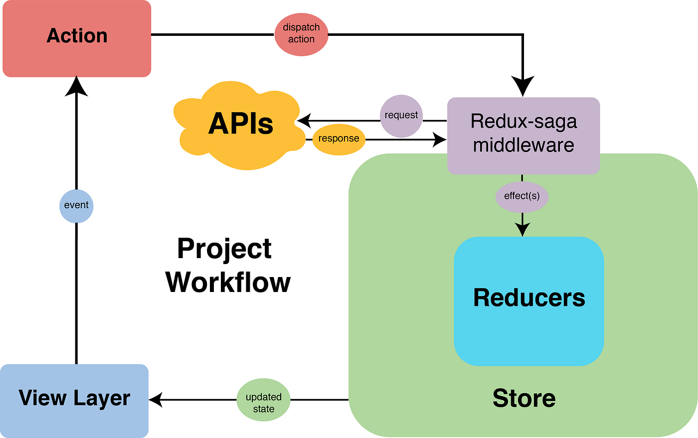

# Redux Saga Integration



### Redux:

#### What is action?

An action is a plain object that represents an intention to change the state. Actions are the only way to get data into the store. Any data, whether from UI events, network callbacks, or other sources such as WebSockets needs to eventually be dispatched as actions.

* Actions are the plain functions
* Get data from React
* Send data to reducer after processing
* Must have type key in return statement
* Must sync type with reducer

#### What is reducer?

A reducer is a function that determines changes to an application's state. It uses the action it receives to determine this change. We can have multiple reducers in a single application. We can use combineReducers to combine them into one root reducer.

* Reducer handle data for store
* Update data in store
* Rules
  * Need root reducer
  * Reducer must return some values
  * Reducer must have some initial state

#### What is store?

he Redux store brings together the state, actions, and reducers that make up your app. The store has several responsibilities:

* Holds application state;
* Allows access to state via getState();
* Allows state to be updated via dispatch(action);
* Registers listeners via subscribe(listener);
* Handles unregistering of listeners via the function returned by subscribe(listener).
* It's important to note that you'll only have a single store in a Redux application. When you want to split your data handling logic, you'll use reducer composition instead of many stores.


### What is Redux Saga?

Redux Saga is a middleware library used to allow a Redux store to interact with resources outside itself asynchronously. This includes making HTTP requests to external services, accessing browser storage, and executing I/O operations. These operations are also known as side effects.

* Handle async data in Redux like APIs data fetching
* We call it middleware
* Middleware between react and redux
* We can write async operations like time taking logics and API calls in redux saga

### JavaScript Generators

```javascript

function* simpleGenerator(array) {
    for (let i = 0; i < array.length; i++) {
        yield array[i];
    }
}

const generatorObj = simpleGenerator([1, 3, 5]);
console.log(generatorObj.next()); // { value: 1, done: false }
console.log(generatorObj.next()); // { value: 3, done: false }
console.log(generatorObj.next()); // { value: 5, done: false }
console.log(generatorObj.next()); // { value: undefined, done: true }

```

```javascript

function* generateId(array) {
    let id = 1;

    while (true) {
        yield id++;
    }
}

const generatorObj = generateId();
console.log(generatorObj.next()); // { value: 1, done: false }
console.log(generatorObj.next()); // { value: 2, done: false }
console.log(generatorObj.next()); // { value: 3, done: false }
console.log(generatorObj.return()); // { value: undefined, done: true }
console.log(generatorObj.next()); // { value: undefined, done: true }

```

```javascript

function* generateId(array) {
  let id = 1;

  while (true) {
    yield id++;
  }
}

const generatorObj = generateId();
console.log(generatorObj.next()); // { value: 1, done: false }
console.log(generatorObj.next()); // { value: 2, done: false }
console.log(generatorObj.next()); // { value: 3, done: false }
console.log(generatorObj.return(10)); // { value: 10, done: true }
console.log(generatorObj.next()); // { value: undefined, done: true }

```

```javascript

function* generateId(array) {
    let id = 1;

    while (true) {
        yield id++;
    }
}

const generatorObj = generateId();
console.log(generatorObj.next()); // { value: 1, done: false }
console.log(generatorObj.next()); // { value: 2, done: false }
console.log(generatorObj.next()); // { value: 3, done: false }
console.log(generatorObj.throw(new Error("Error"))); // Error: Error...
console.log(generatorObj.next());

```
